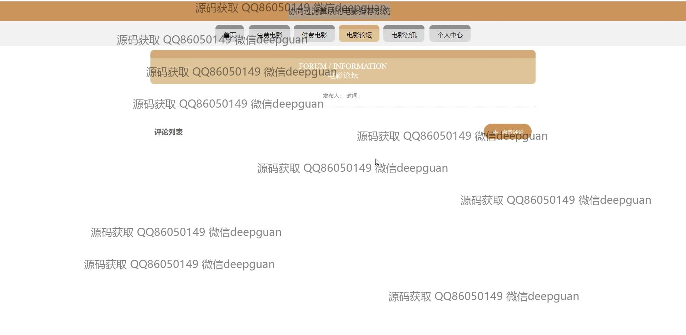
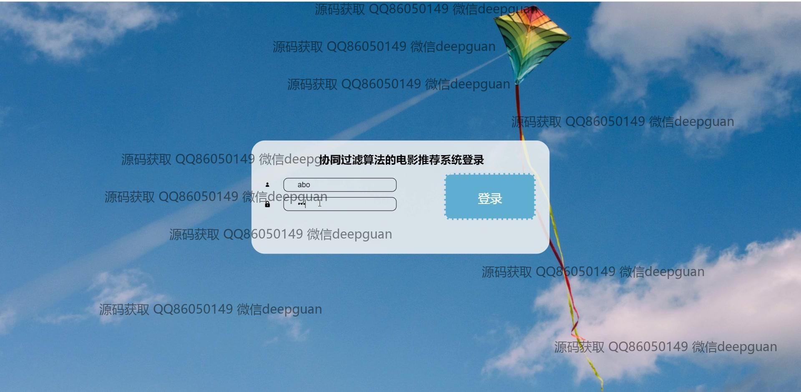
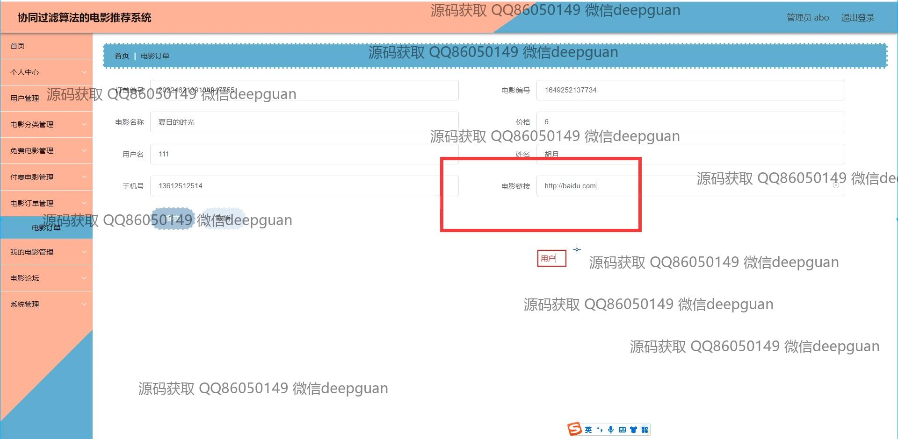

<h1 align="center">协同过滤算法的电影推荐系统</h1>

## 简介
协同过滤算法的电影推荐系统：角色分为管理员和用户；提供用户注册与登录、电影信息管理、电影订单管理、论坛交流、个性化电影推荐等功能。系统界面设计简洁，支持广泛的用户互动与电影管理操作。    --计算机毕业设计源码；毕设源码；java毕业设计源码

## 联系方式

<h3 align="center">获取完整代码与数据库文件 + 微信：deepguan QQ: 86050149 QQ群: 783742310</h3>

<h3 align="center">可帮忙远程部署 包运行成功！提供远程部署、修改代码、设计文档指导、代码讲解等服务！</h3>

## 功能介绍（完整见运行截图）
管理员：基本功能包括登录、注册和退出。网站首页提供主导航栏及轮播图，支持电影分类管理、电影信息上传与编辑，包括海报上传、评分、时长、导演等详细信息设置。后台还提供用户管理、免费电影管理、付费电影管理、订单管理和评论管理等功能，便于管理员综合管理系统内容。

用户：支持注册、登录和退出功能。主页展示推荐电影，提供免费电影和付费电影的分类浏览功能。用户可通过搜索框查询电影，查看电影详情并提交订单，填写相关信息后完成支付，获取电影链接。个人中心允许用户管理个人信息、查询订单、修改密码及管理收藏。

访客：可访问首页，浏览免费电影和付费电影的推荐内容。通过论坛功能查看或参与电影相关评论交流，提升用户互动体验。

系统：基于协同过滤算法，通过分析用户的观影记录与偏好，推荐个性化电影选择，支持动态更新推荐内容并提供电影详情信息，提升推荐精准度与用户体验。

## 运行截图

本代码来源于网络,仅供学习参考使用!

